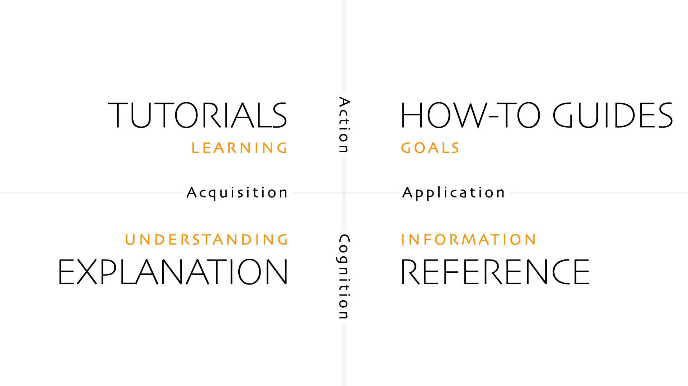

# Contributing

Thanks for being here and for being awesome! 👍

The following sections outline the different ways to contribute to the project.

## Repository Organization

SaladCloud documentation follows [Diátaxis](https://diataxis.fr/) principles.



In our documentation, we label the "Explanation" section "Products", but otherwise, the structure is the same.

- **Products**: Information about the products, what they do, what they cost, and how to use them.
- **Tutorials**: Step-by-step guides which teach how to use the products. These do not try to achieve a particular
  outcome, but rather to teach a particular skill. They do not assume background knowledge.
- **How-to Guides**: Guides that explain how to do something of practical value, using the products. They assume some
  background knowledge.
- **Reference**: API documentation for the products.

### Directory Structure

- The directory structure should match the final website structure.
- Images should be placed in a sibling directory to the markdown file that references them, named `images`.

## Discussing

The easiest way to contribute to the project is by participating in community discussions on the [SaladCloud Discord
server][discord]. The community often chimes in with helpful advice when you have a question, and you may also find
yourself providing answers and helping others. Be sure to review the [code of conduct][code-of-conduct-page] before
participating.

_Please do not use GitHub issues to ask a question._ We will politely close a GitHub issue that asks a question and
kindly refer you to the SaladCloud Discord server or [official support][support].

_Please do not use public GitHub issues to report a security vulnerability._ Instead, refer to our [security
policy][security-page] for responsible disclosure options.

## Reporting Issues

You can create a [GitHub issue][issues] to report problems with our documentation. You can also contact [official
support][support] if you found a problem with the product.

_Please do not use public GitHub issues to report a security vulnerability._ Instead, refer to our [security
policy][security-page] for responsible disclosure options.

## Reporting Security Vulnerabilities

We take security seriously, and we appreciate your cooperation in disclosing vulnerabilities to us responsibly. Refer to
our [security policy][security-page] for more details.

_Please do not use public GitHub issues to report a security vulnerability._

## Changing Code

Interested in changing the world?

First, setup your local development environment. You need [Visual Studio Code][vscode-dl] and a recent version of
[Node.js][nodejs-dl] installed (we recommend the latest LTS version).

Second, fork this repository and clone your fork to your local machine.

Third, open the project in Visual Studio Code and install the recommended workspace extensions. Refer to the [Visual
Studio Code documentation][vscode-extensions] on recommended extensions to learn more.

Fourth, create a new branch for your changes, make your modifications, and commit them with a clear message.

Finally, push your changes to your fork and create a pull request against this repository.

Additionally, please consider taking a moment to read Miguel de Icaza's blog post titled [Open Source Contribution
Etiquette][etiquette-1] and Ilya Grigorik's blog post titled [Don't "Push" Your Pull Requests][etiquette-2].

[code-of-conduct-page]: ./CODE_OF_CONDUCT.md
[discord]: https://discord.gg/ApSm4Kn7Aq
[etiquette-1]: https://tirania.org/blog/archive/2010/Dec-31.html
[etiquette-2]: https://www.igvita.com/2011/12/19/dont-push-your-pull-requests/
[issues]: https://github.com/SaladTechnologies/salad-cloud-docs/issues
[nodejs-dl]: https://nodejs.org/en/download/
[security-page]: ./SECURITY.md
[support]: https://docs.salad.com/support
[vscode-dl]: https://code.visualstudio.com/download
[vscode-extensions]: https://code.visualstudio.com/docs/editor/extension-marketplace#_recommended-extensions

## Adding Endpoints

To add a new endpoint (like dreambooth or transcription) to the documentation, follow these steps:

1. Place the openapi3 compatible input and output json schema for the endpoint in the `scripts/inputs-and-outputs`
   directory
2. Place a config file in `scripts/endpoint-schema-configs`, with the following structure:
   ```json
   {
     "baseSchema": "api-specs/salad-cloud.json",
     "inputSchema": "scripts/inputs-and-outputs/dreambooth-sd15-input.json",
     "outputSchema": "scripts/inputs-and-outputs/dreambooth-output.json",
     "endpointId": "dreambooth-sd15",
     "endpointName": "Dreambooth Training API - Stable Diffusion 1.5",
     "schemaName": "DreamboothSD15Training",
     "apiDocPath": "reference/dreambooth/sd15"
   }
   ```
3. To run all config files, use `./scripts/add-all-endpoints`

## Adding Recipes

To add a new recipe to the documentation, follow these steps:

1. Place the openapi3 spec for the recipe in the `api-specs` directory, named for the recipe. It should match the
   directory name in the `salad-recipes` repository.
2. Run `./scripts/add-recipe <path-to-spec>` to generate the recipe pages.
3. Add the recipe to the navigation in `mint.json`. Find the `navigation` array in `mint.json`, and add your recipe
   pages to the appropriate section.
